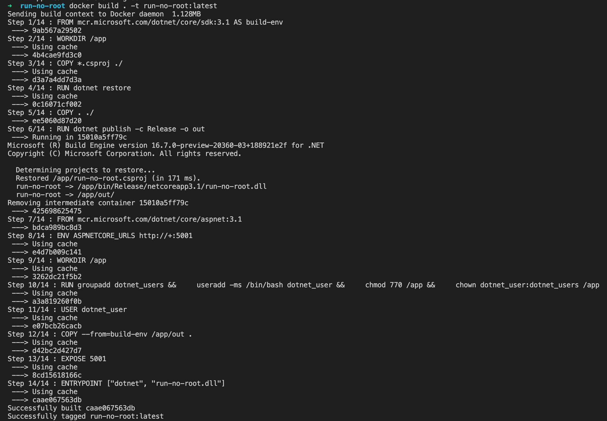
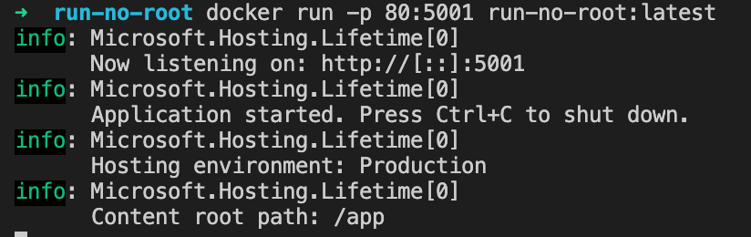
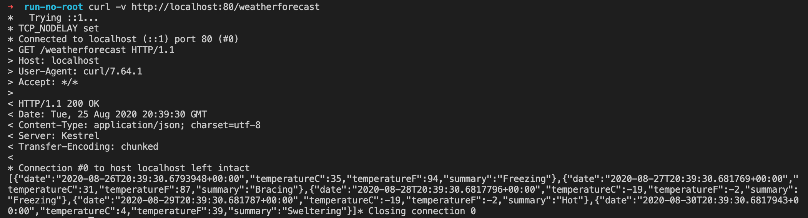
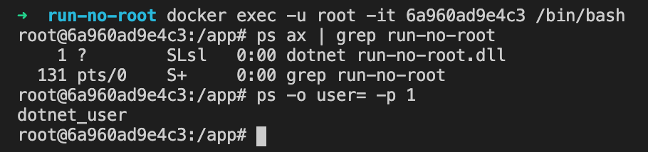

# Execute Asp.net Core API in docker with no root user

## 1 - build docker images

```shell
docker build . -t run-no-root:latest
```



## 2 - run aspnet core api from docker

```shell
docker run -p 80:5001 run-no-root:latest
```



# test aspnet core api from docker

## on the host ( localhost )

```shell
curl -v http://localhost:80/weatherforecast
```



# in docker 

```shell
docker exec -u root -it {CONTAINER_ID} /bin/bash
```

